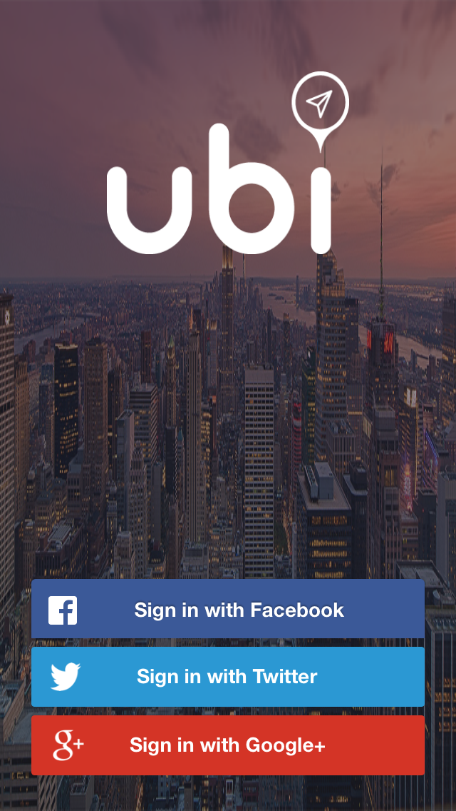
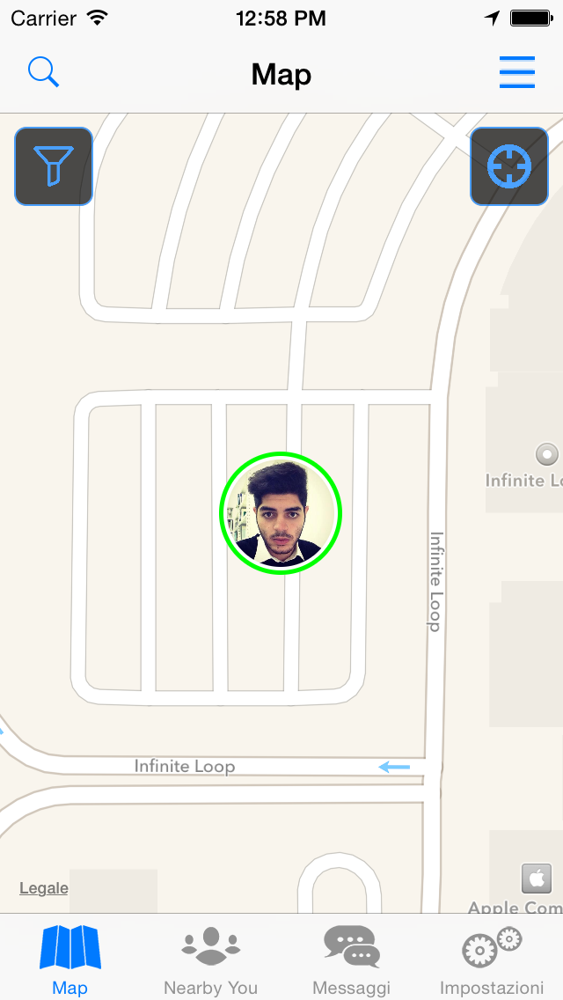
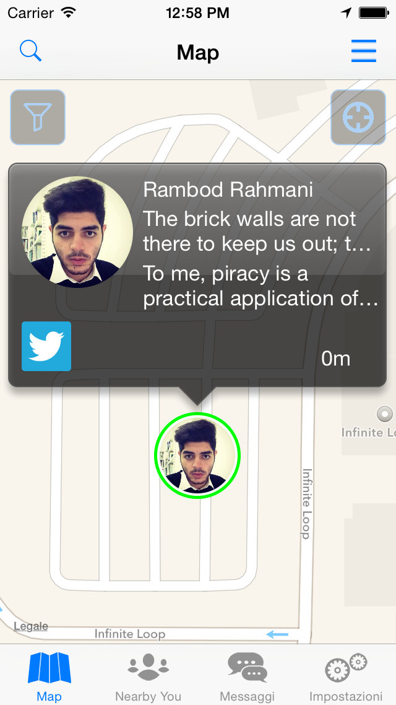
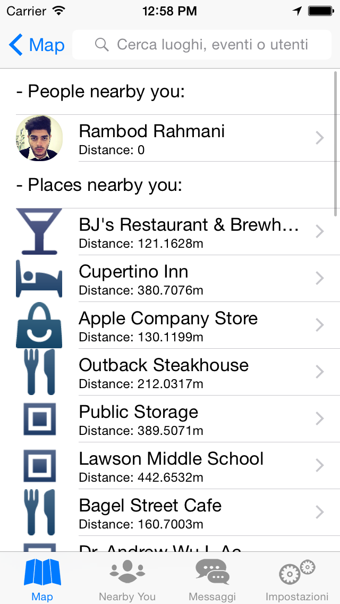
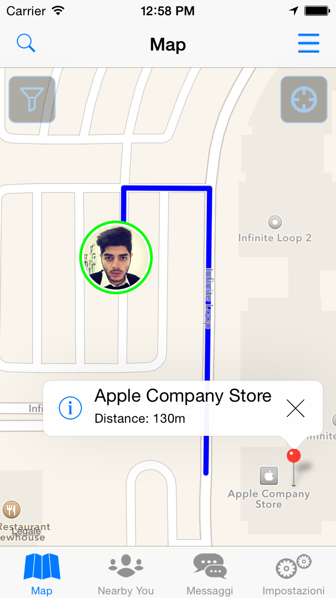
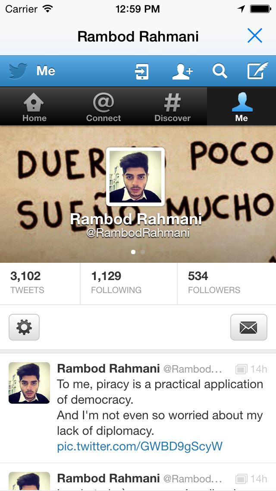

# Ubi App
iOS and Android Social Networking App. Ubi is a geolocation based app which connects users with nearby people, events and places.
Ubi connects people with the freedom they have always wanted.

Ubi è un’app che sfruttando la geo-localizzazione ne esalta e sintetizza le migliori potenzialità in modo semplice ed efficiente.

Per maggiori informazioni: https://itunes.apple.com/it/app/ubi/id960096837?mt=8

Per maggiori informazioni: http://ubisocial.it

Di seguito alcune screenshot dell'applicazione in esecuzione su iOS:

      

##### Maggiori informazioni disponibili sul mio profilo Linkedin: https://www.linkedin.com/in/rambodrahmani

Rambod Rahmani <rambodrahmani@autistici.org>
